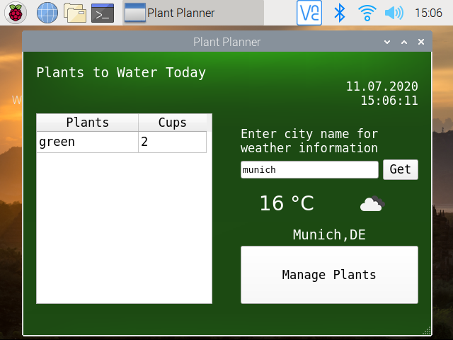
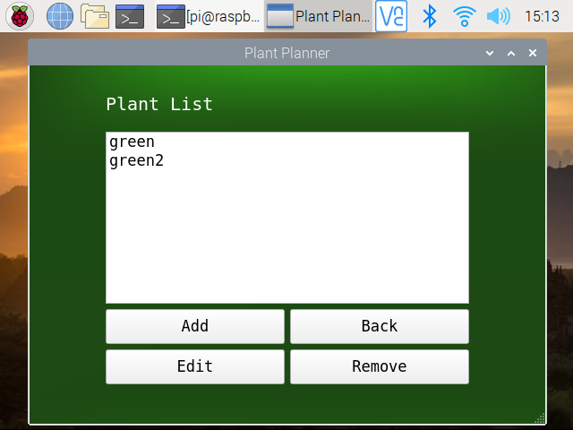
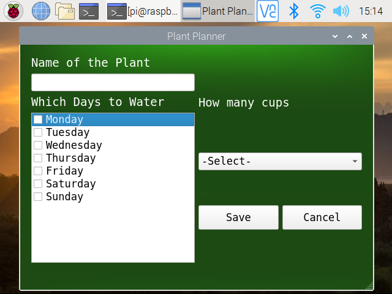

# PlantPlanner-Raspberry-Pi

PlantPlanner is a small application to schedule the watering days of your plants at home. You can give your plants names, select their watering days and how much water do they need. 

  

## Requirements

- Ubuntu 16.04
- Rapberry Pi 3 Model B+
- Cross-compilation of Raspberry Pi for Qt Development
- Qt Creator

## Running

- After successful completion of cross-compiling, the source files can be opened in the Qt Creator from the host PC and compiled for the Raspberry Pi Kit.
- The project should have the "-platform xcb" flag in the Qt Creator's Build & Run configuration.
- Also in the Qt Creator's Build & Run settings, the environment the following variables shoule be added:"DISPLAY:0" , "XAUTHORITY=/home/pi/.Xauthority"

## Future Work

- Connection with the humidity sensors for tracking soil information.

## References

- Cross-compiling guide:[RaspberryPi2EGLFS](https://wiki.qt.io/RaspberryPi2EGLFS)
- The application icon is taken from [pngtree](https://pngtree.com/freepng/vector-leaf-icon_4147183.html).
- The weather data and icons are taken from [OpenWeather API](https://openweathermap.org).
- The virtual keyboard for Qt is taken from [TI Qt Keyboard Template](https://processors.wiki.ti.com/index.php/Qt_Keyboard_Template).
